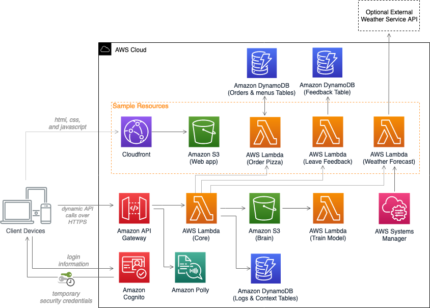

# Serverless Bot Framework

The Serverless Bot Framework is a collection of AWS services combined into a single solution that any company can use to have a scalable and high-available multi-language audiobot, chatbot and touch interface with their customers.

## On this Page

- [Architecture Overview](#architecture-overview)
- [Deployment](#deployment)
- [Source Code](#source-code)
- [Creating a custom build](#additional-resources)

## Architecture Overview



## AWS CDK Constructs

[AWS CDK Solutions Constructs](https://aws.amazon.com/solutions/constructs/) make it easier to consistently create well-architected applications. All AWS Solutions Constructs are reviewed by AWS and use best practices established by the AWS Well-Architected Framework. This solution uses the following AWS CDK Constructs:

- aws-cognito-apigateway-lambda.
- aws-lambda-dynamodb.
- aws-cloudfront-s3
- aws-s3-lambda
- aws-lambda-s3.

## Deployment

The solution is deployed using a CloudFormation template with a lambda backed custom resource. For details on deploying the solution please see the details on the solution home page: [Serverless Bot Framework](https://aws.amazon.com/solutions/serverless-bot-framework/)

## Source Code

**source/infrastructure**
Includes AWS CDK code describing the architecture of the solution. This CDK code will be transpiled into Cloudformation template when running `build-s3-dist.sh`.

**source/samples**
Includes three components, a lambda function that integrates with Amazon Lex, a custom resource, and a front-end web client. This code can be extended to add different functionalities to the bot.

**source/services**
Includes source code for three lambda functions, core, lex-bot, webclient-setup, and polly-service.

**source/services/solution-helper**
A Python Lambda function used as a CloudFormation custom resource for configuring Amazon S3 bucket notifications and to send anonymous metrics.

## Creating a custom build

The solution can be deployed through the CloudFormation template available on the solution home page: [Serverless Bot Framework](https://aws.amazon.com/solutions/implementations/serverless-bot-framework/).
To make changes to the solution, download or clone this repo, update the source code and then run the deployment/build-s3-dist.sh script to deploy the updated Lambda code to an Amazon S3 bucket in your account.

### Prerequisites:

- [AWS Command Line Interface](https://aws.amazon.com/cli/)
- Node.js 12.x or later
- Python 3.8 or later
- [AWS CDK](https://aws.amazon.com/cdk/)
- (Optional) [AccuWeather](https://developer.accuweather.com/) or [OpenWeather](https://openweathermap.org/api) API keys

### 1. Create the deployment packages

Build the distributable:

```
ARTIFACT_BUCKET=my-bucket-name     # S3 bucket name where customized code will reside
SOLUTION_NAME=my-solution-name     # customized solution name
VERSION=my-version                 # version number for the customized code

cd ./deployment
chmod +x ./build-s3-dist.sh
./build-s3-dist.sh $ARTIFACT_BUCKET $SOLUTION_NAME $VERSION
```

> **Notes**: The _build-s3-dist_ script expects the bucket name as one of its parameters, and this value should not include the region suffix. In addition to that, the version parameter will be used to tag the npm packages, and therefore should be in the [Semantic Versioning format](https://semver.org/spec/v2.0.0.html).

### 2. Create Amazon S3 Buckets

The CloudFormation template is configured to pull the Lambda deployment packages from Amazon S3 buckets in the region the template is being launched in. You need to create two buckets in the desired region. The names of the buckets should be `$ARTIFACT_BUCKET` and `$ARTIFACT_BUCKET-<region-name>`. For example, the following will create two buckets in the us-east-1 region.

```
aws s3 mb s3://$ARTIFACT_BUCKET --region us-east-1
aws s3 mb s3://$ARTIFACT_BUCKET-us-east-1 --region us-east-1
```

Deploy the distributable to the Amazon S3 bucket in your account:

```
aws s3 sync ./global-s3-assets s3://$ARTIFACT_BUCKET/$SOLUTION_NAME/$VERSION --acl bucket-owner-full-control
aws s3 sync ./regional-s3-assets s3://$ARTIFACT_BUCKET-us-east-1/$SOLUTION_NAME/$VERSION --acl bucket-owner-full-control
```

### 3. Launch the CloudFormation template.

- Get the link of the serverless-bot-framework.template uploaded to your Amazon S3 bucket.
- Deploy the serverless bot framework to your account by launching a new AWS CloudFormation stack using the link of the serverless-bot-framework.template.

## Known Behavior

When using the 'Leave Feedback' intent, the bot only accepts one-word feedback.

---

Copyright 2020-2021 Amazon.com, Inc. or its affiliates. All Rights Reserved.

Licensed under the Apache License, Version 2.0 (the "License");
you may not use this file except in compliance with the License.
You may obtain a copy of the License at

    http://www.apache.org/licenses/LICENSE-2.0

Unless required by applicable law or agreed to in writing, software
distributed under the License is distributed on an "AS IS" BASIS,
WITHOUT WARRANTIES OR CONDITIONS OF ANY KIND, either express or implied.
See the License for the specific language governing permissions and
limitations under the License.removed api and email